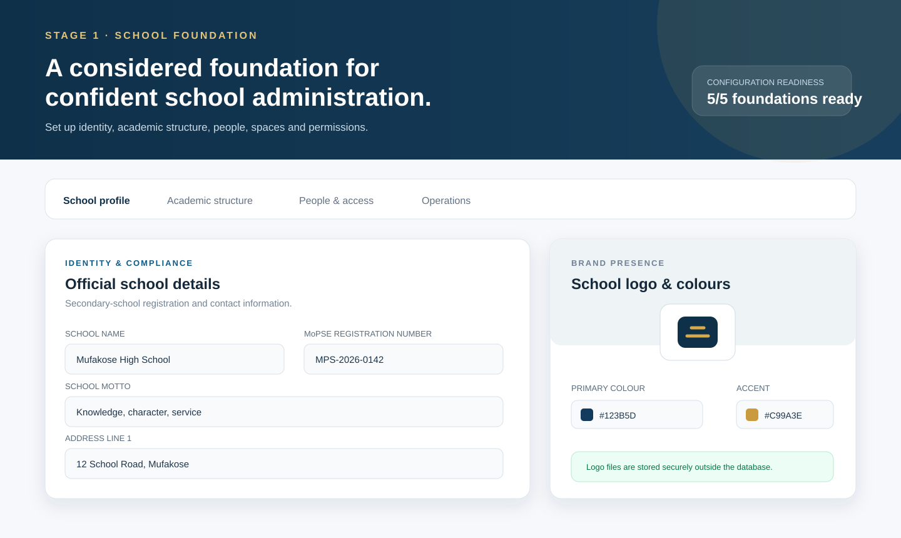
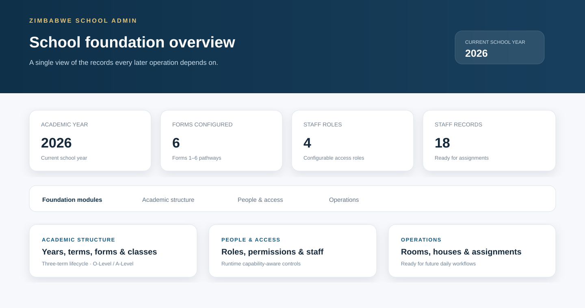

<div align="center">

# Zimbabwe School Admin

### A secure, structured foundation for Zimbabwean secondary-school administration

<p>
  
  
  
  
  
</p>

<p>
  <strong>Zimbabwe School Admin</strong> is a role-aware web application for establishing the core identity, academic structure, people, facilities, and permissions that a school needs before day-to-day operations can scale.
</p>

<p>
  <a href="#capabilities">Capabilities</a> ·
  <a href="#screenshots">Screenshots</a> ·
  <a href="#getting-started">Getting started</a> ·
  <a href="CONTRIBUTING.md">Contributing</a> ·
  <a href="SECURITY.md">Security</a>
</p>

</div>

## Overview

School administration software should reflect the terminology, compliance context, and working patterns of the schools it serves. This project provides a focused first-stage foundation for Zimbabwean secondary schools, including MoPSE-oriented school identity, three-term academic years, Forms 1–6 pathways, configurable staff roles, and permission-aware setup workflows.

The current release is intentionally scoped to **Stage 1: school foundation**. It establishes dependable records and access controls for future modules such as attendance, assessment, student records, communication, and reporting.

## Capabilities

| Area | Current coverage |
| --- | --- |
| School identity | School name, motto, MoPSE registration details, contacts, address, headteacher, logo, and brand colours |
| Academic structure | Academic years, three-term lifecycle, Forms 1–6, O-Level/A-Level pathways, classes, streams, and attendance modes |
| People and access | Staff records, configurable staff roles, permissions, runtime capability checks, and role-aware UI states |
| Subjects and departments | Subject catalogue and school departments with protected create and lifecycle actions |
| Facilities | Rooms and laboratories for the school foundation setup |
| Houses | House records with colour support |
| Teaching assignments | Teacher–subject–class–academic-year assignments with referential integrity |
| Documents | Securely referenced school documents and logo uploads backed by object storage |
| Engineering foundation | React, TypeScript, Vite, Tailwind CSS, tRPC, Drizzle ORM, MySQL-compatible storage, and Vitest coverage |

## Screenshots

The dashboard uses a calm navy-and-gold visual system designed for administrative clarity. The images below are repository-local product previews and are kept in `docs/screenshots/` so the README remains stable even if external image hosting changes.

<div align="center">



<br />



</div>

## Getting started

### Prerequisites

| Requirement | Recommended version |
| --- | --- |
| Node.js | 20 or newer |
| pnpm | 10.x |
| MySQL-compatible database | A reachable development database |
| Object storage | Required for logo and document upload workflows |

### Installation

```bash
git clone https://github.com/PraiseTechzw/zimbabwe-school-admin.git
cd zimbabwe-school-admin
pnpm install
```

Create a local environment file with the database and application settings required by the server runtime. Do not commit secrets or production credentials.

```bash
cp .env.example .env 2>/dev/null || touch .env
```

Apply the database migrations, run the development server, and open the local URL shown by Vite:

```bash
pnpm db:push
pnpm dev
```

### Quality checks

Run the same checks used by the repository workflow before opening a pull request:

```bash
pnpm check
pnpm test
pnpm build
```

## Architecture

The application is organized as a TypeScript monorepo-style project with a Vite React client, an Express-compatible server entrypoint, shared types, tRPC procedures, and Drizzle database definitions.

```text
client/       React UI, pages, reusable components, and styling
server/       tRPC routers, database access, storage, authentication, and tests
shared/       Shared constants and application types
drizzle/      Database schema migrations and relations
docs/         Project documentation and repository-local screenshots
.github/      CI, issue forms, pull request templates, and repository guidance
```

The foundation workflow is deliberately capability-aware: the server checks the authenticated user’s role and permission before allowing protected setup actions, while the UI reflects those capabilities to avoid presenting misleading controls.

## Project status and roadmap

| Stage | Scope | Status |
| --- | --- | --- |
| Stage 1 | School identity, academic foundation, people, facilities, permissions, assignments, and secure file references | In progress / foundation build |
| Stage 2 | Student records, guardians, enrolment, and class lists | Planned |
| Stage 3 | Learner academic history, explicit progression, ZIMSEC results, configurable A-Level admission, and portal status | Implemented in [`docs/STAGE3_ACADEMIC_HISTORY.md`](docs/STAGE3_ACADEMIC_HISTORY.md) |
| Stage 4 | Fee structures, invoicing, and payment tracking | Implemented in `server/finance.ts` and the finance tRPC domain |
| Stage 5 | Attendance, discipline, learner welfare, safeguarding, medical, and boarding workflows | Implemented in [`docs/STAGE5_ATTENDANCE_WELFARE.md`](docs/STAGE5_ATTENDANCE_WELFARE.md) |
| Stage 6 | School finance, USD/ZiG accounts, invoices, payments, assistance, reconciliation, reports, and Paynow configuration | Implemented in [`docs/STAGE6_SCHOOL_FINANCE.md`](docs/STAGE6_SCHOOL_FINANCE.md) |
| Stage 7 | Communication, dashboards, exports, and operational workflows | Planned |
| Stage 8 | School timetable, teacher workload, room and laboratory allocation, clash detection, and daily operations | Implemented in [`docs/STAGE8_TIMETABLE_OPERATIONS.md`](docs/STAGE8_TIMETABLE_OPERATIONS.md) |
| Stage 11 | Reporting, audit, security, Student ID integrity, system health, notifications, and production readiness | Implemented in [`docs/STAGE11_PRODUCTION_READINESS.md`](docs/STAGE11_PRODUCTION_READINESS.md) |

## Contributing

Contributions are welcome when they improve correctness, usability, security, or suitability for Zimbabwean school workflows. Please read [`CONTRIBUTING.md`](CONTRIBUTING.md) and [`docs/GITHUB_WORKFLOW.md`](docs/GITHUB_WORKFLOW.md) before opening an issue or pull request. Coding agents must also follow [`AGENTS.md`](AGENTS.md). All participants are expected to follow the project’s [`CODE_OF_CONDUCT.md`](CODE_OF_CONDUCT.md).

## Security

Please do not disclose security vulnerabilities in public issues. Follow the private reporting guidance in [`SECURITY.md`](SECURITY.md).

## Support

For product questions, implementation discussion, or usage help, see [`SUPPORT.md`](SUPPORT.md). Before requesting help, include the relevant command, expected result, actual result, and a minimal reproduction where possible.

## License

This project is licensed under the [MIT License](LICENSE).

## References

[1]: https://react.dev/ "React documentation"
[2]: https://vite.dev/ "Vite documentation"
[3]: https://orm.drizzle.team/docs/overview "Drizzle ORM documentation"
[4]: https://docs.github.com/en/repositories/creating-and-managing-repositories/about-repositories "GitHub repository documentation"

The project’s technology references are linked above for readers who want to explore the underlying frameworks and repository conventions. [1] [2] [3] [4]
